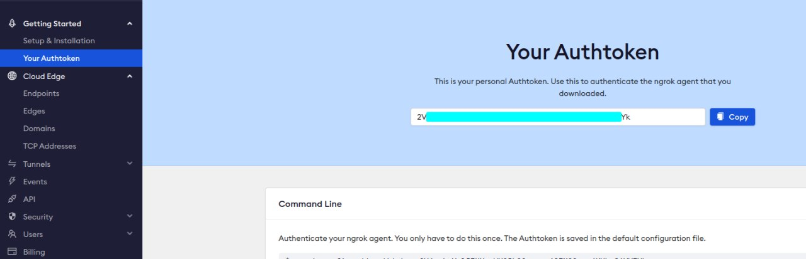
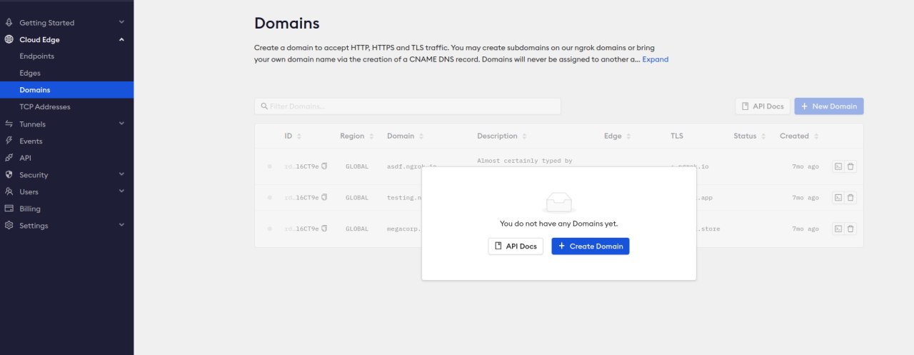
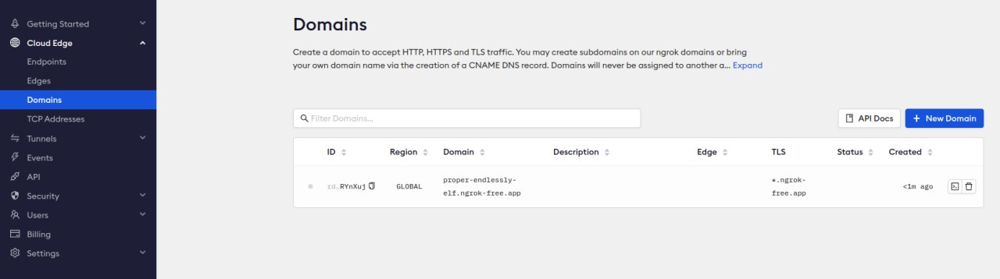

# Noise Management Application

## Features
1. __Passive Noise Cancellation__ - Apply passive noise cancellation using noise isolating materials _e.g. aerogel sheets_
2. __Auto Petitioning__ - Gather petitions from a cluster of residence facing a consistent noisy environment
3. __Noise Statistics__ - Provide easy to understand noise data and statistics for users, _e.g. noise level, noise frequency, noise duration, etc._

## Dependencies
Before getting starting with development or running the application, install the following tools:
- [Git](https://git-scm.com/downloads)
- [Docker](https://docs.docker.com/)
- [Docker Compose](https://docs.docker.com/compose/)
- [Ngrok Account](https://ngrok.com/)

## Installation
1. Clone the repository and `cd` into it 
```bash
git clone git@github.com:sunfire-systems/cs462-ay2023-t1-g1-1.git noise-mgmt-app
cd noise-mgmt-app
```

2. Copy the `example.env` as `.env`
```bash
cp example.env .env
vim .env
```

3. Configure the `.env file with your own Ngrok Credentials`

You can find your `NGROK_TOKEN` on your account's dashboard


For the `NGROK_DOMAIN`, you will need to create a custom domain on your account's dashboard as well



4. Start/Build the containers

To start or build the containers, you can use the following command:
```bash
# start docker compose and build required images
docker compose up --build
```

5. Accessing the application

After starting the application with `docker compose`, the application will be accessible via `localhost:8080` or your `NGROK_DOMAIN`
